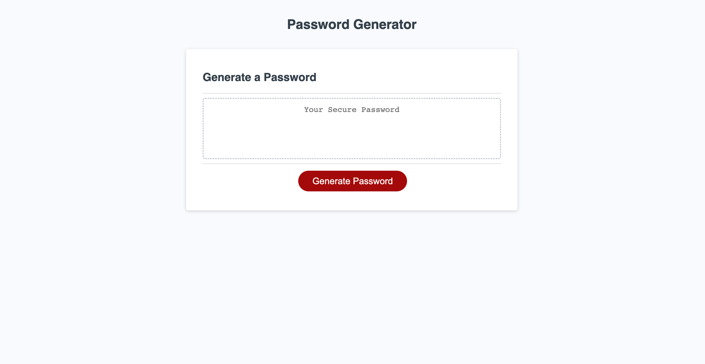

# Module-3-Challenge-JS-Password-Generator

## Description

Provide a short description explaining the what, why, and how of your project. Use the following questions as a guide:

I created the Random Password Generator project to help people generate strong and unique passwords easily. The main problem it solves is the challenge of having weak passwords for online accounts. With this tool, users can define the password length and choose character sets, such as lowercase letters, uppercase letters, numbers, and special characters. While building this project, I deepened my understanding of JavaScript programming, learned to handle user input, and improved my skills in generating random passwords.

## Usage

1. Open Password Generator at (https://simonmagidenko.github.io/Module-3-Challenge-JS-Password-Generator/)
2. Click the red button labeled "Generate Password" 
3. Answer the prompts presented at the top of the page
4. Receive your randomly generated password containing the criteria you selected!

## Credits

- Simon Magidenko (https://github.com/SimonMagidenko)
- MDN Web Docs - Mozilla (https://developer.mozilla.org/en-US/)
- W3Schools (https://www.w3schools.com/)

